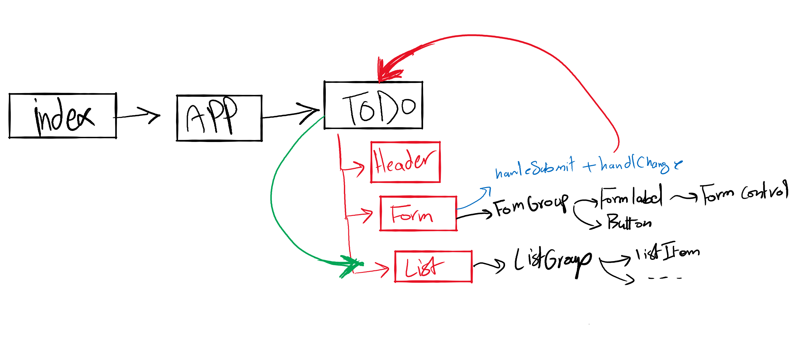

# Lab 33

## Project: To-Do app

### Author: Diana Alazzam

### Links and Resources

- [submission PR](https://github.com/diana96alazzam-401-advanced-javascript/todo/pull/4)
<!-- - [ci/cd](http://xyz.com) (GitHub Actions) 
- [back-end server url](http://xyz.com) (when applicable)  -->
- [front-end application-netlify](https://wonderful-noether-187f79.netlify.app/) 

### Setup

- `npm install`

#### How to initialize/run this application

- `npm start` and it will redirect you to `http://localhost:3000/`

#### UML

// not yet

#### Notes

- Lab 32 : 
  * the form doesn't reset after submit.

